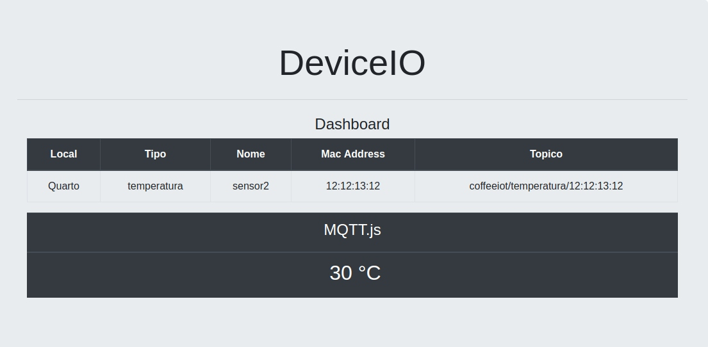

# DeviceIO



DeviceIO é um projeto para adoção de dispositivos IOT, utiliza o Django Framework, Firebase Authentication (para autenticação do usuário) e o RealTime Database (para gerenciar dispositivos adotados). O cadastro do dispositivo IOT é feito com Qrcode e o protocolo de comunicação é o MQTT.

## Instalação


```bash
python3 -m venv (nome)

/source (nome)/bin/activate

pip install -r requirements.txt

```

## Pré-requisito

Crie um projeto Web no Firebase. Nas configurações do projeto copie e cole o script no arquivo settings.py

```bash

FIREBASE_CONFIG = {

    "apiKey": "seu script",
    "authDomain": "seu script",
    "databaseURL": "seu script",
    "projectId": "seu script",
    "storageBucket": "seu script",
    "messagingSenderId": "seu script",
    "appId": "seu script"
} 
    
```
## Cadastro de Dispositivos

No cadastro de dispositivo caso não possua uma webcam e/ou um Qrcode, insira manualmente no campo Qrcode as informações do tipo do dispositivo e seu macAddress separados por ';' exemplo:(temperatura;12:12:12:14). 

## Links Utilizados

Firebase  : Authentication, Database. [Pyrebase](https://github.com/thisbejim/Pyrebase)

Qrcode    : [instascan](https://github.com/schmich/instascan)

Protocolo : [MQTT.js](https://github.com/mqttjs)

## Contribuição

Hussan [guithub](https://github.com/hussanhijazi)

Gabriel [guithub](https://github.com/gbbocchini)

Grandes amigos, grandes desenvolvedores. Obrigado!
